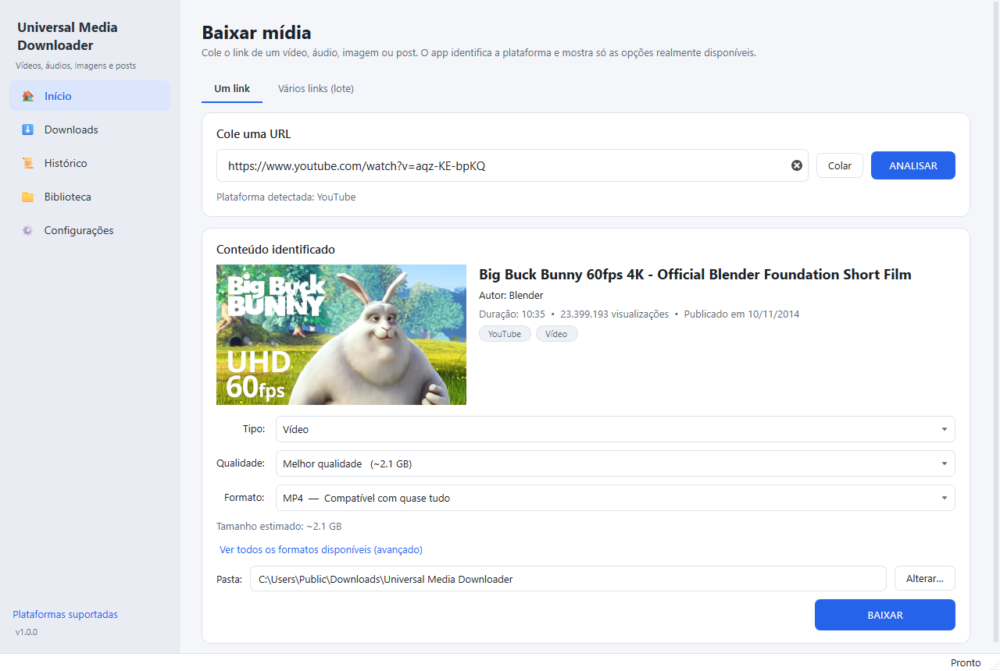
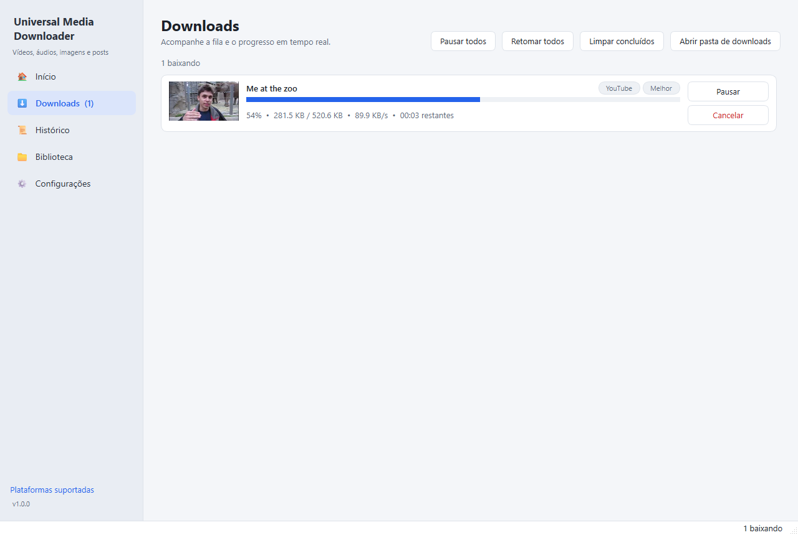
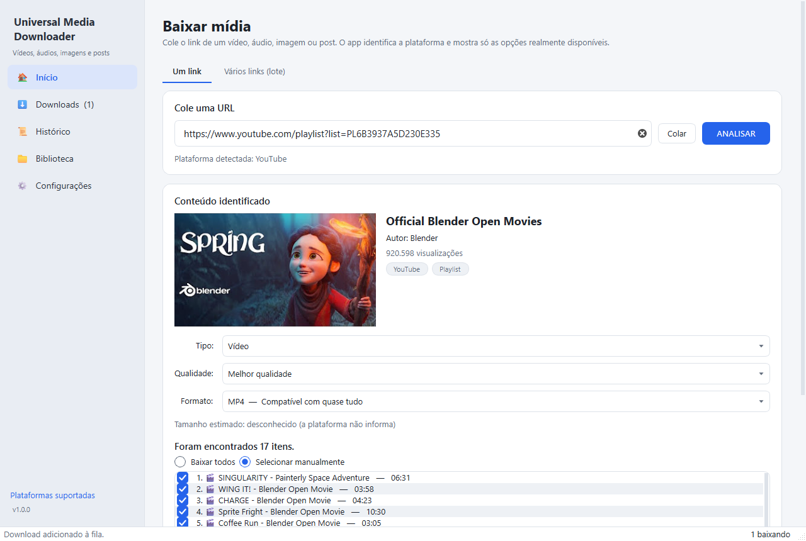
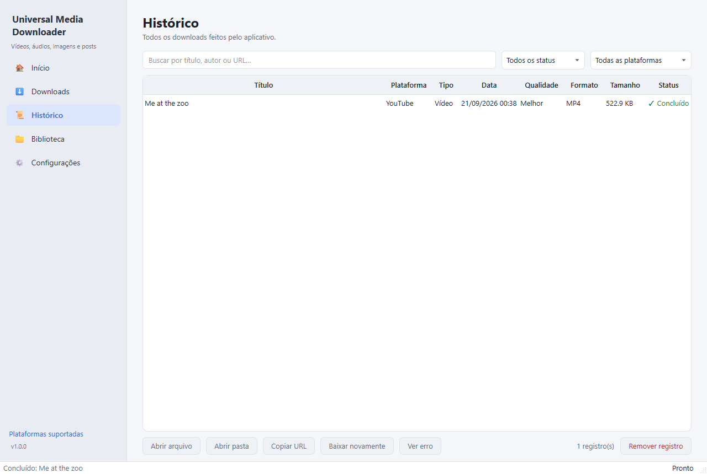
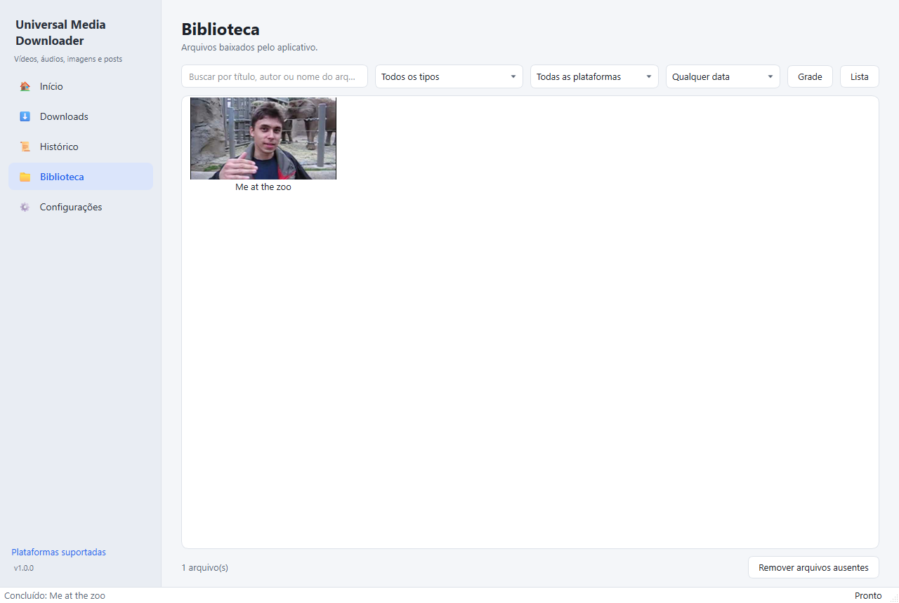
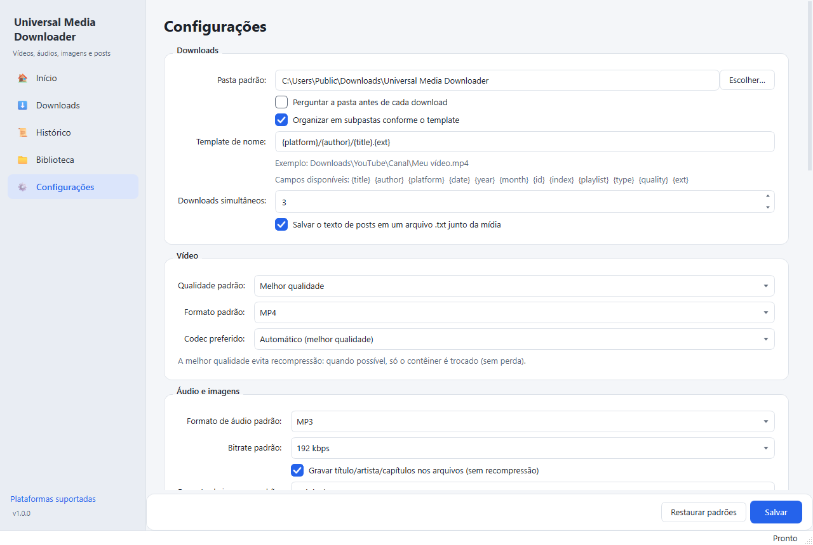
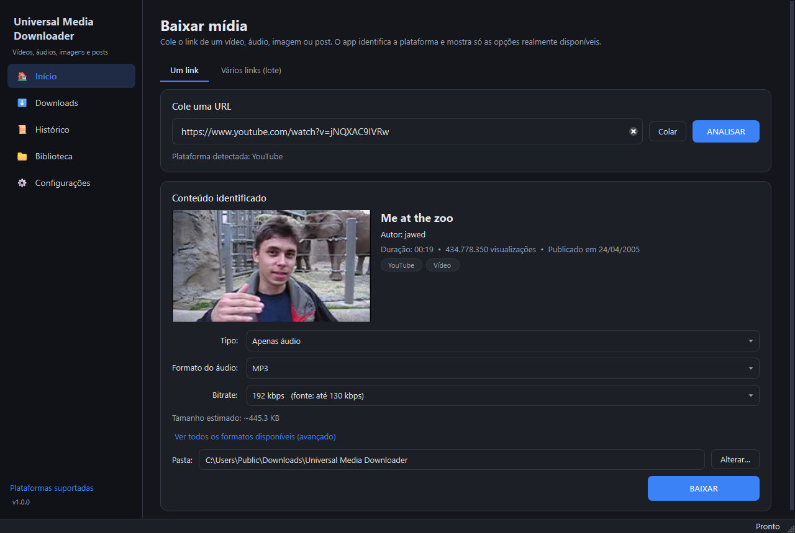

# Universal Media Tools

Aplicativo desktop para baixar **vídeos, áudios, imagens e posts** de redes
sociais e sites de mídia a partir de uma URL: um "gerenciador de downloads
para redes sociais" com interface moderna, fila com downloads simultâneos,
histórico, biblioteca e linha de comando. Inclui também um **conversor de
arquivos** (vídeo, áudio, imagem, PDF, texto/Markdown, documentos do Office
e compactados), que antes era o projeto separado *Universal Converter*.

Você cola o link, o app identifica a plataforma e o tipo de conteúdo, mostra
preview, título, autor, duração e **só as qualidades/formatos que realmente
existem**. Você escolhe o que baixar e acompanha o progresso em tempo real.

**Baixar:** instalador para Windows em [Releases](https://github.com/alabypedro/media-tools/releases/latest)
· código em [github.com/alabypedro/media-tools](https://github.com/alabypedro/media-tools).



> As capturas de tela são de quando o app ainda se chamava *Universal Media Downloader* e não
> tinha a aba Converter; o resto da interface continua igual.

---

## ⚠️ Uso responsável

Use esta ferramenta **apenas para conteúdo que você tem autorização para
baixar**: conteúdo próprio, em domínio público, com licença que permita
download, ou quando a plataforma e o autor permitem.

O aplicativo **não contorna DRM, paywalls, controles de acesso nem
autenticação**, e não acessa conteúdo privado sem autorização. Quando uma
plataforma bloqueia tecnicamente o download (DRM, conteúdo pago, privado,
restrito por região), o app **mostra uma mensagem clara** em vez de tentar
burlar a proteção.

O uso de cookies do navegador existe só para você acessar, com a **sua própria
sessão**, conteúdo ao qual **você já tem acesso**. O app nunca pede nem guarda
senhas e nunca grava o conteúdo dos cookies. Respeite os termos de uso de cada
plataforma e os direitos autorais.

---

## Sumário

- [Recursos](#recursos)
- [Plataformas](#plataformas)
- [Telas](#telas)
- [Instalação (usuário final)](#instalação-usuário-final)
- [Desenvolvimento](#desenvolvimento)
- [Execução](#execução)
- [Linha de comando](#linha-de-comando)
- [Build para Windows](#build-para-windows)
- [Atualizações do programa](#atualizações-do-programa)
- [Configuração](#configuração)
- [Solução de problemas](#solução-de-problemas)
- [Arquitetura](#arquitetura)
- [Testes](#testes)
- [Dependências e licenças](#dependências-e-licenças)
- [Limitações conhecidas](#limitações-conhecidas)

---

## Recursos

**Análise da URL (sem baixar nada ainda)**
- Valida a URL, detecta a plataforma e escolhe a engine certa (yt-dlp, gallery-dl ou download direto).
- Mostra thumbnail, título, autor, duração, visualizações, data e tipo (vídeo, Short, Reel, clipe, live, áudio, imagem, galeria, post, playlist, canal, perfil).
- Lista **só as opções disponíveis**: resoluções reais (2160p, 1440p, 1080p...), bitrates da fonte, formatos, codecs e tamanho estimado. FLAC só aparece quando a fonte tem áudio sem perdas.
- Tabela avançada com todos os formatos (ID, resolução, FPS, codecs, bitrate, tamanho), para escolher um formato exato.

**Download**
- Presets de qualidade: **Melhor**, **1080p**, **720p**, **480p**, **Apenas áudio** e **Original**.
- Vídeo em MP4/MKV/WEBM e áudio em MP3/M4A/OPUS/WAV/FLAC. Imagens no original ou em JPG/PNG/WEBP.
- **Sem recompressão desnecessária**: na melhor qualidade o app prefere streams compatíveis e só troca o contêiner (remux). Áudio e vídeo separados são juntados pelo FFmpeg.
- Playlists, canais, perfis, subreddits e galerias: "Baixar todos" ou "Selecionar manualmente".
- Posts com vários arquivos (carrosséis, galerias): "Baixar tudo" ou "Selecionar arquivos". Opcionalmente, **texto do post, autor, data e URL** vão num `.txt` junto da mídia.
- Transmissões ao vivo: grava a partir de agora, com o botão **"Parar e salvar"**.

**Gerenciador de downloads**
- Fila com downloads simultâneos configuráveis, progresso, velocidade, ETA e tamanho.
- **Pausar/retomar**: continua de onde parou quando a plataforma/servidor permitem.
- **Cancelar** apaga os arquivos parciais.
- **Novas tentativas automáticas** em falhas temporárias (rede, tempo limite, limite de acessos), com espera crescente.
- Limite de velocidade, intervalo entre downloads e tamanho máximo por arquivo.
- Downloads interrompidos (app fechado) podem ser **retomados na próxima abertura**.

**Organização, histórico e biblioteca**
- Templates de nome, ex.: `{platform}/{author}/{title}.{ext}`, com nomes sanitizados para o Windows. O app nunca sobrescreve: gera `nome (1).ext`.
- **Histórico** (SQLite) com busca e filtros: abrir arquivo, abrir pasta, copiar URL, baixar novamente, ver erro, remover registro.
- **Biblioteca** em grade ou lista, com miniaturas, filtros por tipo, plataforma e data, e busca por título, autor ou nome do arquivo.

**Conversor de arquivos** (tela **Converter** e `umd convert`)
- Vídeo ↔ vídeo e vídeo → áudio (FFmpeg), áudio ↔ áudio, imagem ↔ imagem (inclui GIF animado, AVIF e, com `pillow-heif`, HEIC).
- PDF → imagens (páginas escolhidas, DPI e qualidade), imagem/texto/Markdown → PDF, e **várias imagens → um PDF** na ordem que você escolher.
- **Achatar PDF** (formato de saída "PDF achatado"): campos de formulário preenchidos, caixas de seleção e anotações (comentários, carimbos, destaques) viram conteúdo fixo da página e o PDF deixa de ser editável, como o flatten do Sejda. Gera `nome (achatado).pdf`; links continuam clicáveis e PDFs com senha são recusados com aviso. Antes era o script `scripts/flatten_pdf.py`.
- Documentos, planilhas e apresentações (DOCX, XLSX, PPTX, ODT...) via **LibreOffice**, se estiver instalado.
- Compactados: ZIP, 7Z e TAR (gz, bz2, xz), com proteção contra caminhos maliciosos ("zip slip").
- Fila com vários arquivos ou pastas inteiras (mantendo as subpastas), só mostra os formatos de saída **comuns a todos**, prévia de imagens e PDFs, pausar entre arquivos e cancelar sem deixar FFmpeg/LibreOffice abertos.
- Os originais nunca são alterados. Se o arquivo de saída já existir: criar `nome (1).ext` (padrão), sobrescrever ou pular.
- Histórico de conversões próprio. Na **Biblioteca**, clique com o botão direito num arquivo baixado → **Converter…**.
- Arquivos do computador arrastados para qualquer tela vão para o conversor.

**Editor de GIF, animações e vídeo** (tela **Editor** e `umd edit`), com as ferramentas do [ezgif.com](https://ezgif.com), mas no seu computador
- **Criar GIF** com imagens na ordem que você escolher (um GIF na lista entra com todos os quadros, então também serve para **juntar GIFs**).
- **Vídeo → GIF**, WebP, APNG ou AVIF animado: trecho, quadros por segundo e largura. E o caminho de volta: **GIF → MP4/WebM**.
- **Redimensionar**, **cortar** (área), **girar/espelhar**, **recortar duração**, **velocidade**, **inverter** e **vai e volta** (bumerangue).
- **Efeitos**: preto e branco, sépia, negativo, brilho, contraste, saturação, desfoque, nitidez e cor no lugar da transparência.
- **Texto** (legenda com contorno, estilo meme), **marca-d'água** (imagem por cima, com opacidade) e **censurar área** (desfocar, pixelar ou tarja).
- **Otimizar**: menos cores, menos quadros, quadros repetidos juntados, qualidade do WebP/AVIF/JPG/vídeo e vídeo sem áudio.
- **Dividir em quadros** (pasta ou ZIP), **sprite sheet** (montar e cortar) e **juntar vídeos**.
- Funciona com GIF, WebP, APNG, AVIF, PNG, JPG e vídeos (MP4, WebM, MKV, MOV...). No vídeo → vídeo o áudio acompanha o corte, a velocidade e a inversão.
- O original nunca é alterado: o resultado sai como `nome (redimensionado).gif` e o botão **Editar o resultado** encadeia a próxima ferramenta. Prévia animada do original e do resultado.

**Renomeador em lote** (tela **Renomear** e `umd rename`)
- **Modelo do nome** com campos: `{name}` (nome atual), `{n:3}` (contador: 001, 002...), `{date:%Y-%m-%d}` (data da foto), `{parent}` (pasta) e `{ext}`. Modelos prontos para numerar em sequência e para nomear pela data.
- **Localizar e substituir** por texto ou **regex** (com `\1`, `\2` para os grupos), ignorando ou não maiúsculas. É aplicado antes do modelo.
- **Data EXIF**: usa a data em que a foto foi tirada. Sem EXIF (ou em arquivo que não é foto), usa a data de modificação, ou pula o arquivo, à sua escolha.
- Caixa do nome e da extensão (minúsculas, maiúsculas, iniciais maiúsculas) e contador com início e ordem (lista, nome ou data).
- **Prévia antes de aplicar**: a tabela mostra o nome atual e o novo de cada arquivo conforme você muda as opções; nada é alterado no disco até clicar em **Renomear**.
- A extensão é mantida, o arquivo não muda de pasta e **nada é sobrescrito**: nome repetido ganha ` (1)`. Trocas dentro do lote (`1→2`, `2→3`) funcionam.
- Se um arquivo falhar (aberto em outro programa), os que já tinham sido renomeados voltam atrás. **Desfazer última renomeação** devolve os nomes antigos.
- **Enviar para o Converter** leva os arquivos já renomeados para a fila do conversor.

**Outros**
- Download em lote: cole várias URLs ou importe TXT/CSV.
- Arrastar e soltar links na janela.
- Tema claro/escuro/sistema e idioma português/inglês.
- Verificação e **atualização segura** do yt-dlp e do gallery-dl dentro do próprio app.
- Erros sempre em linguagem simples, com **"Ver detalhes técnicos"** para o log real.
- CLI `umd`, que usa exatamente os mesmos serviços da interface.

---

## Plataformas

O app **reconhece** as plataformas abaixo pelo endereço. Quem de fato baixa
são as engines ([yt-dlp](https://github.com/yt-dlp/yt-dlp) e
[gallery-dl](https://github.com/mikf/gallery-dl)), e o suporte é conferido
nos extratores instalados, sem nada fixado no código. A tela
**Plataformas suportadas** (no menu lateral) e o comando `umd --platforms`
mostram a situação real da sua instalação.

Situação com yt-dlp 2026.08.19 e gallery-dl 1.32.13:

| Plataforma | yt-dlp | gallery-dl | Observação |
|---|:-:|:-:|---|
| YouTube (vídeos, Shorts, lives, playlists, canais) | ✓ | – | Precisa de runtime JavaScript (Deno ou Node.js) para liberar todos os formatos |
| Instagram (posts, carrosséis, Reels, perfis) | ✓ | ✓ | Quase tudo exige login: use os cookies do seu navegador |
| TikTok (vídeos e posts de fotos) | ✓ | ✓ | Posts de fotos usam o gallery-dl |
| Facebook (vídeos, Reels, fotos) | ✓ | ✓ | Muitos conteúdos exigem login |
| X / Twitter | ✓ | ✓ | Vídeos pelo yt-dlp, imagens pelo gallery-dl |
| Reddit (posts, galerias, subreddits) | ✓ | ✓ | |
| Twitch (VODs, clipes, lives) | ✓ | – | |
| Pinterest | ✓ | ✓ | |
| Vimeo, SoundCloud, Dailymotion | ✓ | – | |
| Bluesky | ✓ | ✓ | |
| Tumblr | ✓ | ✓ | |
| Imgur | ✓ | ✓ | |
| **Kwai** | ✕ | ✕ | **Sem extrator dedicado**: só tentativa pelo extrator genérico, e o app avisa |
| **Threads** | ✕ | ✕ | **Sem extrator dedicado**: só tentativa pelo extrator genérico, e o app avisa |
| Outros sites | ✓ | ✓ | Qualquer um dos 1800+ sites do yt-dlp ou dos 300+ do gallery-dl, pelo modo genérico |

Links diretos de mídia (`https://site/video.mp4`, `.jpg`, `.mp3`...) são
baixados diretamente, com retomada. Quando nada reconhece o link, a resposta é
**"Esta plataforma/conteúdo não é suportado atualmente."**

---

## Telas

| | |
|---|---|
|  **Downloads**: progresso, velocidade e ETA |  **Playlist**: seleção de itens |
|  **Histórico** |  **Biblioteca** |
|  **Configurações** |  **Tema escuro** |

Estrutura da janela:

```text
┌──────────────┬──────────────────────────────────────────────┐
│ 🏠 Início     │  Cole uma URL  [______________] [Colar][ANALISAR]
│ ⬇ Downloads  │  ┌ Conteúdo identificado ──────────────────┐  │
│ 🔄 Converter  │  │ [thumb]  Título • Autor • Duração        │  │
│ 🎞 Editor     │  │ Tipo / Qualidade / Formato / Pasta       │  │
│ ✏ Renomear   │  │                                          │  │
│ 📜 Histórico  │  │                              [ BAIXAR ]  │  │
│ 📁 Biblioteca │  └─────────────────────────────────────────┘  │
│ ⚙ Config.    │  Aba "Vários links (lote)": lista, importar TXT/CSV
│ Plataformas  │
└──────────────┴──────────────────────────────────────────────┘
```

---

## Instalação (usuário final)

**Com o instalador (recomendado):** baixe `UniversalMediaTools-Setup-<versão>.exe` em
[Releases](https://github.com/alabypedro/media-tools/releases/latest) (ou gere com o
[build](#build-para-windows)) e siga o assistente, em português.
- Não pede Administrador: instala só para você em `%LOCALAPPDATA%\Programs\Universal Media Tools`. No assistente dá para escolher instalar para todos os usuários.
- Cria atalho no Menu Iniciar e, se você marcar, na Área de Trabalho.
- Opção (desmarcada) de colocar o comando `umd` no PATH, para usar `umd` e `umd convert` em qualquer terminal.
- Aparece em "Aplicativos instalados" do Windows, com desinstalador. Para atualizar, use **Verificar atualizações** no app (ver [Atualizações do programa](#atualizações-do-programa)) ou rode o instalador da versão nova por cima.
- A desinstalação mantém o histórico, a Biblioteca e as configurações (em `%LOCALAPPDATA%`), além dos arquivos baixados.
- Instalação silenciosa: `UniversalMediaTools-Setup-<versão>.exe /VERYSILENT /TASKS=addtopath`.

**Versão portátil (zip):** extraia `UniversalMediaTools-<versão>-win64.zip` numa
pasta e abra **`UniversalMediaTools.exe`**.

Requisitos: Windows 10 ou 11 de 64 bits. Não é preciso instalar Python nem FFmpeg: tudo vai junto.
Recomendado para o YouTube: instale o [Deno](https://deno.com/) ou o
[Node.js](https://nodejs.org/). Sem um runtime JavaScript, alguns formatos do
YouTube podem não aparecer (o app avisa).

> O executável não é assinado digitalmente. Na primeira execução o Windows
> SmartScreen pode mostrar "O Windows protegeu o computador": clique em
> **Mais informações → Executar assim mesmo**.

---

## Desenvolvimento

Requisitos: **Python 3.10+** (testado com 3.14) no Windows.

```powershell
git clone https://github.com/alabypedro/media-tools.git universal-media-tools
cd universal-media-tools
python -m venv .venv
.venv\Scripts\activate
pip install -r requirements-dev.txt
```

Opcional, para ter o comando `umd` no terminal:

```powershell
pip install -e .
```

---

## Execução

Interface gráfica:

```powershell
python -m umd
```

Ou dê um duplo clique em **`UniversalMediaTools.bat`**, que usa o Python
instalado, sem janela de console.

---

## Linha de comando

```text
umd "https://exemplo.com/video"                 baixa com as configurações padrão
umd URL --quality 1080p                         presets: best, 1080p, 720p, 480p, audio, original
umd URL --audio mp3 [--bitrate 320]             só o áudio (mp3, m4a, opus, wav, flac, original)
umd URL --format mkv                            contêiner do vídeo (mp4, mkv, webm, original)
umd URL --output "C:\Downloads"                 pasta de destino
umd URL1 URL2 URL3                              vários links (vão para a fila)
umd --file urls.txt                             lista TXT/CSV
umd URL --items "1-3,7"                         itens específicos de playlist/galeria
umd URL --info [--json]                         só analisar: metadados, qualidades, formatos
umd URL --cookies-from-browser firefox          usar a SUA sessão do navegador
umd --check-engines                             versões do yt-dlp, gallery-dl, FFmpeg, runtime JS
umd --update-engines                            atualiza yt-dlp/gallery-dl com segurança
umd --platforms                                 suporte real de cada plataforma
umd --help                                      todas as opções
```

Sem `pip install -e .`, use `python -m umd <argumentos>` no lugar de `umd`.
Na versão empacotada, use o `umd.exe` que fica ao lado do app.

Opções como `--rate-limit`, `--template` e `--concurrent` valem **só para
aquela execução**: a CLI nunca altera as configurações salvas.

Códigos de saída: `0` tudo concluído, `1` alguma falha, `2` uso incorreto, `130` interrompido (Ctrl+C).

**Conversor de arquivos:**

```text
umd convert video.mov mp4                       converte um arquivo (o original fica intacto)
umd convert relatorio.docx pdf                  documentos do Office (precisa do LibreOffice)
umd convert manual.pdf png --pages "1-3" --dpi 300
umd convert "C:\Fotos" jpg --recursive --output "C:\Fotos convertidas"
umd convert foto.png jpg resultado.jpg          nome de saída exato
umd convert --images-to-pdf a.jpg b.png album.pdf
umd convert formulario.pdf flatten              achata o PDF -> "formulario (achatado).pdf" ("achatar" também vale)
umd convert "C:\Formularios" flatten            achata todos os PDFs da pasta (pula os já achatados)
umd convert --formatos                          lista os formatos suportados
umd convert                                     modo interativo (pergunta arquivo e formato)
umd convert --help                              todas as opções
```

Outras opções: `--overwrite` (sobrescreve em vez de criar `nome (1).ext`),
`--quality N`, `--quiet`, `--verbose` e `--debug`.

**Editor de GIF, animações e vídeo:**

```text
umd edit gato.gif --resize 50%                  gera "gato (editado).gif" (o original fica intacto)
umd edit gato.gif saida.gif --crop 10,10,200,150 --rotate 90
umd edit gato.gif --speed 2 --reverse           também: --boomerang, --delay MS, --loop N
umd edit gato.gif --text "bom dia" --text-position top
umd edit gato.gif --overlay logo.png --overlay-scale 20 --overlay-opacity 60
umd edit gato.gif --censor 40,30,120,80 --censor-mode pixelate
umd edit gato.gif --colors 64 --drop-every 2    GIF menor
umd edit gato.gif --to mp4                      GIF -> vídeo (também webp, apng, avif, webm...)
umd edit video.mp4 --to gif --start 2 --end 6 --fps 12 --resize 480x
umd edit video.mp4 corte.mp4 --start 5 --end 12 --mute
umd edit --make a.png b.png c.png -o anim.gif --delay 200
umd edit --split anim.gif --format png [--zip]  um arquivo por quadro
umd edit --sprite anim.gif -o folha.png --columns 4
umd edit --unsprite folha.png -o anim.gif --columns 4 --rows 2
umd edit --merge a.mp4 b.mp4 -o junto.mp4
umd edit --help                                 todas as opções (efeitos, cores, qualidade...)
```

**Renomeador em lote** (sem `--apply`, só mostra a prévia):

```text
umd rename "C:\Fotos\Viagem" --exif                       prévia: 2024-03-15 14.30.22.jpg ...
umd rename "C:\Fotos\Viagem" --exif --apply               renomeia de verdade
umd rename pasta -p "Férias {n:3}"                        Férias 001.jpg, Férias 002.jpg...
umd rename pasta -p "{date:%Y-%m} {name}" --exif-only     pula quem não tem data EXIF
umd rename pasta --find "IMG_" --replace "foto-"          troca um trecho do nome
umd rename pasta --find "(\d+)-(\d+)" --replace "\2-\1" --regex
umd rename *.JPG --case lower --ext-case lower            tudo em minúsculas
umd rename pasta -r --sort date -p "{parent} {n}"         com subpastas, numerando pela data
umd rename --undo                                         desfaz a última renomeação
umd rename --help                                         todos os campos e opções
```

---

## Build para Windows

```powershell
pip install -r requirements-dev.txt
python build.py --zip --installer
```

Feche o app antes: com ele aberto, o PyInstaller não consegue substituir a pasta `dist`.
O `--installer` precisa do [Inno Setup 6](https://jrsoftware.org/isinfo.php)
(`winget install JRSoftware.InnoSetup`) e usa `packaging/installer.iss`.

Resultado:

```text
dist/UniversalMediaTools/
├── UniversalMediaTools.exe   interface gráfica (sem console)
├── umd.exe                   linha de comando + worker das engines
└── _internal/                Python, Qt, yt-dlp, gallery-dl, ffmpeg/, ícones...
dist/UniversalMediaTools-1.0.0-win64.zip       versão portátil
dist/UniversalMediaTools-Setup-1.0.0.exe       instalador (~115 MB)
```

O `build.py`:
1. copia o FFmpeg (do `imageio-ffmpeg`, ou do caminho em `UMD_FFMPEG`) para `packaging/ffmpeg/`, junto com o aviso de licença;
2. gera o arquivo de versão do Windows;
3. roda o PyInstaller com `packaging/umd.spec`;
4. testa o resultado com `umd.exe --version` e `umd.exe --check-engines`;
5. com `--zip` e `--installer`, gera o zip portátil e o instalador.

A pasta tem cerca de 250 MB (o zip, cerca de 120 MB). O build é *onedir* de
propósito: o worker das engines inicia a cada análise ou download, e no modo
*onefile* cada início precisaria extrair tudo para uma pasta temporária.

---

## Atualizações do programa

As versões novas são publicadas como Releases em
[github.com/alabypedro/media-tools](https://github.com/alabypedro/media-tools/releases).

- **Verificar atualizações**, no menu lateral (ou **Configurações > Atualizações do programa > Verificar agora**), consulta o último Release.
- Ao abrir, o app também verifica em silêncio e, se houver versão nova, mostra **⬆ Atualizar para X.Y.Z** no menu lateral. Dá para desligar esse aviso em Configurações. Ele nunca instala sozinho.
- Ao confirmar, o app baixa `UniversalMediaTools-Setup-<versão>.exe` (só HTTPS e só de endereços do GitHub), confere o **SHA-256** publicado no Release (se não bater, ou se não houver hash, descarta e não instala), fecha, instala por cima e **abre de novo sozinho**. Downloads em andamento são pausados e podem ser retomados; histórico, biblioteca e configurações são mantidos.
- A atualização automática só funciona na cópia instalada pelo instalador. Rodando pelo Python (`UniversalMediaTools.bat`) ou pela pasta `dist`, o app avisa da versão nova e abre a página de download.

Isso é separado da atualização das engines (yt-dlp/gallery-dl), que continua em **Configurações > Engines**.

**Publicar uma versão nova:**

```powershell
python release.py "O que mudou nesta versão"           # correção: 1.2.0 -> 1.2.1
python release.py --minor "O que mudou nesta versão"   # recurso novo: 1.2.0 -> 1.3.0
```

Um comando faz tudo e para no primeiro erro: aumenta `__version__`, roda os testes (`--skip-tests` pula),
gera o executável e o instalador, faz commit e push de tudo (`--no-git` pula), publica no GitHub Releases,
atualiza a lista de builds (`builds.json`) e apaga de `dist/` os arquivos das versões antigas. Se o teste ou o
build falhar, a versão volta ao que era. Usa o GitHub CLI (`winget install GitHub.cli; gh auth login`) e o
Inno Setup 6. Também dá para usar `--major` ou `--version 1.4.2`.

**Builds antigas** ficam só no GitHub; no computador fica a lista:

```powershell
python release.py --list             # versões publicadas, com data, notas e link do instalador
python release.py --install 1.1.0    # baixa do GitHub, confere o SHA-256 e abre o instalador
python release.py --sync             # refaz builds.json a partir do GitHub
python release.py --clean            # só apaga de dist/ os arquivos de versões antigas
```

Os passos avulsos continuam existindo: `python build.py --zip --installer` e `python publish_release.py "notas"`.

A variável `UMD_UPDATE_REPO` troca o repositório consultado (útil para testes).

---

## Configuração

Tudo pela tela **Configurações**:

| Seção | Opções |
|---|---|
| Downloads | pasta padrão, perguntar a pasta a cada download, subpastas, template de nome, downloads simultâneos, salvar texto de posts |
| Vídeo | qualidade padrão, formato padrão, codec preferido (automático, H.264, VP9, AV1) |
| Áudio e imagens | formato e bitrate padrão, gravar metadados, formato de imagem |
| Desempenho | limite de velocidade, conexões simultâneas, tentativas, espera entre tentativas, intervalo entre downloads, retomada, tamanho máximo, tempos limite, máximo de itens por playlist |
| Contas e cookies | usar a sessão de um navegador (Firefox, Chrome, Edge, Brave...) ou um arquivo `cookies.txt` |
| Interface | tema (sistema, claro, escuro) e idioma (português, inglês) |
| Engines | versões, FFmpeg, runtime JavaScript, verificar/instalar atualizações, restaurar versões embutidas, plataformas suportadas, pasta de logs |
| Atualizações do programa | versão instalada, **Verificar agora**, avisar quando houver versão nova (verifica ao abrir; ligado por padrão) |
| Avançado | permitir URLs da rede local |

As opções do conversor ficam na própria tela **Converter**, no link
**Configurações de conversão**: pasta padrão, o que fazer se o arquivo já
existir, manter subpastas, abrir a pasta ao terminar, DPI/qualidade/formato
padrão de PDF → imagem e qualidade/metadados de imagens. O FFmpeg usado é o
mesmo dos downloads (Configurações > Engines).

**Campos do template de nome:** `{title}` `{author}` `{platform}` `{date}`
`{year}` `{month}` `{id}` `{index}` `{playlist}` `{type}` `{quality}` `{ext}`.
Exemplo: `{platform}/{author}/{date} - {title}.{ext}`. As barras do template
criam subpastas. Os valores dos campos nunca criam pastas nem saem da pasta de
destino.

**Onde ficam os dados do app** (configurações, banco, logs, miniaturas, engines atualizadas):

```text
%LOCALAPPDATA%\UniversalMediaTools\
├── settings.json
├── umd.db                 histórico e biblioteca (SQLite)
├── logs\application.log   tudo
├── logs\downloads.log     ciclo de vida dos downloads
├── logs\errors.log        só erros
├── thumbnails\
├── engines\               versões atualizadas do yt-dlp/gallery-dl
└── converter\             config.json e history.db do conversor
```

O app se chamava **Universal Media Downloader**. Instalações dessa época
continuam usando a pasta `%LOCALAPPDATA%\UniversalMediaDownloader\` (e a pasta
de downloads `Downloads\Universal Media Downloader`), sem precisar migrar nada:
o banco guarda caminhos absolutos (miniaturas e arquivos da Biblioteca), então
renomear essas pastas faria a Biblioteca perder os arquivos. O pacote Python e
a CLI continuam se chamando `umd`, e as variáveis de ambiente continuam com o
prefixo `UMD_`.

A variável de ambiente `UMD_HOME` troca essa pasta (útil para um modo
"portátil" e para os testes). Os logs nunca registram senhas, cookies nem
tokens: tudo passa por um filtro que os substitui por `[REDACTED]`.

---

## Solução de problemas

| Sintoma | O que fazer |
|---|---|
| Faltam resoluções no YouTube, ou aviso de "runtime JavaScript" | Instale o Deno (recomendado) ou o Node.js e reabra o app. Confira em Configurações > Engines. |
| "A plataforma exige que você esteja logado" (Instagram, Facebook, X...) | Se você tem acesso ao conteúdo, ative **Contas e cookies** com o navegador em que está logado. |
| "Não foi possível ler os cookies do navegador" | O Chrome e o Edge bloqueiam os cookies enquanto estão abertos. Feche o navegador, use o Firefox, ou exporte um `cookies.txt`. |
| "A plataforma pediu uma verificação de que você não é um robô" | Aguarde alguns minutos, aumente o intervalo entre downloads ou use os cookies da sua sessão. |
| "Esta plataforma/conteúdo não é suportado atualmente" | Nenhuma engine reconhece o link. Atualize as engines (Configurações > Engines > Verificar atualizações). |
| Um site que funcionava parou de funcionar | Plataformas mudam com frequência: **Verificar atualizações** costuma resolver. |
| "Este conteúdo é protegido por DRM" | Não há o que fazer: o app não contorna DRM, por design. |
| "O FFmpeg não foi encontrado" | Na versão empacotada ele vem junto. Em desenvolvimento, `pip install imageio-ffmpeg`, ou indique o caminho em Configurações > Engines. |
| "LibreOffice não foi encontrado" (ao converter DOCX, XLSX, PPTX...) | Instale com `winget install TheDocumentFoundation.LibreOffice` e reabra o app. |
| A tela Converter não oferece o formato que eu quero | A fila mostra só os formatos que servem para **todos** os arquivos. Converta tipos diferentes em lotes separados. |
| Antivírus ou SmartScreen bloqueiam o `.exe` | O executável não é assinado. Libere a pasta do app ou rode a partir do código-fonte. |
| Download ficou "Interrompido" | O app foi fechado durante o download. Clique em **Retomar** na tela Downloads. |
| Preciso ver o erro real | Clique em **"Ver detalhes técnicos"** no diálogo de erro, ou abra `logs\errors.log` (Configurações > Engines > Abrir pasta de logs). |

---

## Arquitetura

Camadas (cada uma só conhece a de baixo):

```text
UI (PySide6) / CLI  →  Services  →  Providers  →  Download Engine (worker)  →  Storage
```

Fluxo de uma URL:

```text
URL → URL Validator → Platform Detector → Provider → Metadata Extractor → Format Selector
    → Download Manager → worker (yt-dlp / gallery-dl / HTTP direto) → FFmpeg → File Storage → History Database
```

```text
universal-media-tools/
├── umd/
│   ├── __main__.py            python -m umd  (GUI sem argumentos, CLI com argumentos)
│   ├── main.py                interface gráfica
│   ├── cli.py                 linha de comando (usa os mesmos serviços)
│   ├── core/                  config (Pydantic), logs com redação, SQLite + migrações, erros amigáveis,
│   │                          validação de URL, nomes/templates, subprocessos seguros, i18n,
│   │                          atualização do programa pelo GitHub Releases (app_update.py)
│   ├── providers/             MediaProvider + 16 plataformas + genérico; adaptadores yt-dlp, gallery-dl e direto
│   ├── engine/                worker (subprocesso), protocolo JSON lines, runner, backends, overrides
│   ├── downloader/            DownloadManager, fila, job, progresso, executor (staging → destino final)
│   ├── media/                 modelos de mídia, seletor de formatos, FFmpeg, conversor
│   ├── database/              modelos e repositórios (histórico e biblioteca)
│   ├── services/              análise, pedidos de download, lote, biblioteca, engines, AppContext
│   ├── convert/               conversor de arquivos (antigo Universal Converter), independente dos downloads:
│   │   ├── core/              registro de formatos e regras, fila, config, histórico (SQLite), caminhos seguros
│   │   ├── converters/        mídia (FFmpeg), imagem, PDF, achatar PDF, texto/Markdown, Office (LibreOffice), compactados
│   │   └── cli.py             umd convert
│   ├── editor/                editor de GIF/animações/vídeo (ferramentas no estilo do ezgif):
│   │   ├── clip.py            animação em memória e operações quadro a quadro (Pillow)
│   │   ├── video.py           o que passa pelo FFmpeg: vídeo → vídeo, vídeo ↔ quadros, juntar vídeos
│   │   ├── tools.py           as ferramentas (o que a tela e a CLI chamam)
│   │   └── cli.py             umd edit
│   ├── rename/                renomeador em lote:
│   │   ├── engine.py          plano (nome atual → nome novo), aplicação tudo-ou-nada e desfazer
│   │   └── cli.py             umd rename
│   └── ui/                    janela, Início, Downloads, Converter, Editor, Renomear, Histórico, Biblioteca,
│                              Configurações, tema, fluxo de atualização do programa (app_update.py)
├── tests/                     testes (pytest + pytest-qt); tests/convert/ para o conversor, tests/editor/ para o editor,
│                              tests/rename/ para o renomeador
├── packaging/                 umd.spec, entradas dos executáveis, installer.iss (Inno Setup)
├── tools/                     gerador de ícone, extrator de textos para tradução
├── assets/                    ícones
├── build.py                   build Windows (.exe, --zip, --installer)
├── publish_release.py         publica uma versão nova no GitHub Releases
├── release.py                 versão + testes + build + commit + publicação + limpeza, num comando só
├── builds.json                lista das versões publicadas (gerada pelo release.py)
├── UniversalMediaTools.bat    abre o app pelo Python instalado
└── requirements*.txt, pyproject.toml
```

**Decisões principais**

- **As engines rodam num subprocesso worker, não em thread.** O yt-dlp e o gallery-dl são usados como biblioteca, mas dentro de um processo filho (`umd --engine-worker`) que conversa com o app por JSON lines (stdin/stdout).
  - **Cancelar é confiável:** o app encerra a árvore de processos inteira, inclusive o FFmpeg filho, e não sobra processo órfão.
  - **Timeouts são de verdade.**
  - **A interface não trava** disputando o GIL.
  - **Um crash de engine não derruba o app.**
  - **As engines podem ser atualizadas sem recompilar o `.exe`.**
- **Área de staging por job**: tudo é baixado em `<destino>/.umd-staging/<id>/`, no mesmo disco. Pausar preserva os parciais, cancelar apaga, e só no fim os arquivos são movidos para o nome definitivo.
- **Suporte real, não presumido**: os providers definem só domínios, ordem de engines e tipo de conteúdo. Se a engine responde "não reconheço", o provider tenta a próxima; se é um erro real (privado, login, DRM), mostra o erro. No genérico, um extrator **dedicado** do gallery-dl ganha do extrator **genérico** do yt-dlp.
- **O conversor não passa pelo worker das engines**: converte arquivos locais numa thread da interface (a tela nunca trava) e cada FFmpeg/LibreOffice que ele abre é encerrado ao cancelar. Ele só compartilha com o resto do app a pasta de dados e a localização do FFmpeg.
- **O editor tem um único conjunto de opções e dois caminhos**: animações e imagens são editadas quadro a quadro pelo Pillow; vídeo → vídeo vai inteiro pelo FFmpeg (para manter o áudio e não carregar o vídeo na memória). As operações seguem sempre a mesma ordem nos dois (trecho → corte → tamanho → giro → efeitos → censura → marca/texto → velocidade). Vídeo → GIF usa o FFmpeg só para tirar os quadros já cortados e redimensionados.
- **Atualização segura das engines**: a versão nova vem do PyPI por HTTPS, com SHA-256 conferido e extração protegida contra path traversal. Ela é validada rodando o worker antes de ser ativada, e a troca é atômica (`engines/active.json`). "Restaurar versões embutidas" desfaz.

**Segurança**
- URLs só `http`/`https`, sem usuário/senha embutidos e sem endereços da rede local por padrão. Cada redirecionamento de download direto é validado.
- As URLs vão para o worker dentro de um JSON pelo stdin, nunca como argumento de linha de comando. Nenhum subprocesso usa `shell=True`.
- Nomes sanitizados (caracteres inválidos e nomes reservados do Windows), limite de tamanho de caminho, proteção contra path traversal, e o app nunca sobrescreve arquivos.
- Arquivos executáveis (`.exe`, `.bat`, `.ps1`, `.lnk`...) vindos das engines são recusados. Nada baixado é aberto automaticamente, e "Abrir" em um executável só mostra a pasta.
- Plugins de terceiros do yt-dlp não são carregados. A configuração do usuário do gallery-dl é ignorada.
- Limites de tamanho (arquivo, listas TXT/CSV, miniaturas) e tempos limite (análise, conexão).
- Logs e detalhes técnicos passam por um filtro que remove cookies, tokens e senhas.
- Atualização do programa: só consulta o GitHub por HTTPS (inclusive depois de redirecionamentos), exige o SHA-256
  publicado no Release, descarta o arquivo se não bater e nunca instala sem confirmação.

**Portabilidade**: o código de sistema operacional está isolado em
`core/paths.py` (pasta de dados por SO) e `core/process.py` (encerramento de
árvore de processos com `taskkill` no Windows e `killpg` em Linux/macOS).
O app foi desenvolvido e testado no Windows.

---

## Testes

```powershell
python -m pytest                   # testes offline (~2 min)
python -m pytest --run-network     # inclui 4 testes contra a internet real (YouTube, Wikimedia)
```

A suíte **não depende da internet**. Os providers usam um runner falso, e os
testes do worker sobem um **servidor HTTP local** para exercitar de verdade o
download direto (com retomada via Range), o yt-dlp e o gallery-dl. A suíte
cobre:
- validação de URL e detecção de plataforma;
- sanitização de nomes, templates e criação de pastas;
- banco de dados;
- fila, cancelamento, pausa, retry e intervalo;
- seleção de formato e interpretação da saída das engines;
- classificação de erros e redação dos logs;
- conversões com FFmpeg e recuperação de gravação ao vivo;
- CLI e download em lote;
- atualização segura das engines (hash adulterado, zip malicioso, ativação e reversão);
- conversor: regras de formato, fila, conflitos de nome, zip slip, cada conversor, `umd convert`, cancelamento (inclusive durante a pausa);
- achatar PDF: formulário e caixas de seleção viram conteúdo fixo sem perder o texto preenchido, links preservados, PDF com senha e PDF inválido;
- editor: cada operação (tamanho, corte, giro, tempo, efeitos, texto, marca-d'água, censura, cores), transparência, formatos animados, vídeo ↔ GIF e vídeo → vídeo com áudio (vídeo de teste gerado pelo FFmpeg), dividir/sprite/juntar, `umd edit`, cancelamento e limite de memória;
- renomeador: modelo, contador, localizar/substituir com regex, data EXIF e data de modificação, conflitos de nome, trocas dentro do lote, tudo-ou-nada quando um arquivo falha, desfazer e `umd rename`;
- interface (pytest-qt), incluindo as telas Converter e Editor com processamento real em segundo plano e a tela Renomear;
- atualização do programa (GitHub simulado, nenhum teste acessa a internet): versões, SHA-256 obrigatório,
  arquivo adulterado descartado, redirecionamento para fora do GitHub recusado, aviso ao abrir sem diálogos,
  cópia fora do instalador só oferece a página de download.

---

## Dependências e licenças

| Componente | Uso | Licença |
|---|---|---|
| [yt-dlp](https://github.com/yt-dlp/yt-dlp) | engine de vídeo/áudio | Unlicense |
| [yt-dlp-ejs](https://github.com/yt-dlp/ejs) | desafios JavaScript do YouTube | Unlicense, MIT e ISC |
| [gallery-dl](https://github.com/mikf/gallery-dl) | engine de imagens, galerias e posts | GPL-2.0-only |
| [PySide6 / Qt](https://www.qt.io/qt-for-python) | interface gráfica | LGPL-3.0 (ou GPL) |
| [FFmpeg](https://ffmpeg.org) (build [gyan.dev](https://www.gyan.dev/ffmpeg/builds/) via imageio-ffmpeg) | merge e conversão | GPL-3.0 (esta build) |
| [imageio-ffmpeg](https://github.com/imageio/imageio-ffmpeg) | fornece o binário do FFmpeg | BSD-2-Clause |
| [Pydantic](https://docs.pydantic.dev) | configurações e modelos | MIT |
| [Requests](https://requests.readthedocs.io) | download direto e atualizações | Apache-2.0 |
| [Pillow](https://python-pillow.org) | conversão de imagens | MIT-CMU |
| [PyMuPDF](https://pymupdf.readthedocs.io) | PDF → imagem e prévia de PDF | **AGPL-3.0** (ou licença comercial) |
| [pypdf](https://github.com/py-pdf/pypdf) | achatar PDF (formulários e anotações) | BSD-3-Clause |
| [ReportLab](https://www.reportlab.com/opensource/) | texto/Markdown/imagens → PDF | BSD |
| [Python-Markdown](https://python-markdown.github.io) | Markdown → PDF | BSD-3-Clause |
| [py7zr](https://github.com/miurahr/py7zr) | arquivos 7Z | LGPL-2.1+ |
| [LibreOffice](https://www.libreoffice.org) (não incluído; usado se instalado) | documentos do Office | MPL-2.0 |
| [PyInstaller](https://pyinstaller.org) | empacotamento (só no build) | GPL-2.0+ com exceção de bootloader |
| [Inno Setup](https://jrsoftware.org/isinfo.php) | instalador (só no build) | licença própria (gratuita) |
| [GitHub CLI](https://cli.github.com) | publicar versões (só para quem publica) | MIT |

**Ao redistribuir o executável** (não é aconselhamento jurídico):
- O **FFmpeg** vai como programa separado, com o aviso `ffmpeg/FFMPEG-LICENSE.txt` indicando onde obter o código-fonte (GPL-3.0).
- O **Qt/PySide6** (LGPL) vai como DLLs separadas (build *onedir*), o que permite substituí-las.
- O **gallery-dl** é GPL-2.0-only e é importado como biblioteca, então distribuir o pacote pronto pede que o conjunto seja distribuído sob termos compatíveis com a GPL-2.0 (com o código-fonte disponível).
- O **PyMuPDF** (do conversor) é AGPL-3.0, que também é *copyleft* e **não é compatível com a GPL-2.0-only** do gallery-dl. Distribuir um único pacote com os dois pode não ser possível sob os termos abertos; as saídas seriam trocar o PDF → imagem por outra biblioteca, distribuir o conversor separado, ou obter a licença comercial do PyMuPDF. Para uso pessoal, isso não se aplica.

A licença do código deste projeto fica a critério do autor, que deve escolher
uma compatível com esse cenário antes de distribuir.

---

## Limitações conhecidas

- **Kwai e Threads**: nenhuma das engines tem extrator dedicado hoje. O app reconhece os links, tenta o extrator genérico e avisa que o resultado pode ser incompleto ou não funcionar.
- **Instagram, Facebook e X** frequentemente exigem login mesmo para conteúdo público. Nesses casos é preciso usar os cookies da sua sessão.
- **Pausar no gallery-dl** retoma por arquivo: arquivos já concluídos não são baixados de novo, e o arquivo em andamento continua do `.part` quando o servidor permite.
- **Playlists**: a análise usa extração rápida ("flat"), então as qualidades por item só são conhecidas no download. Os presets funcionam como **prioridade** (ex.: "Até 1080p" escolhe a maior resolução até 1080p de cada vídeo).
- Páginas de arquivo do Wikimedia Commons listam também as **versões antigas** do arquivo. Use "Selecionar arquivos" para escolher.
- A troca de idioma vale a partir da próxima abertura do app. As mensagens de erro do conversor e do editor ainda são só em português.
- **Editor**: as áreas de cortar e censurar são informadas em números (X, Y, largura, altura), sem seleção com o mouse sobre a prévia. O GIF é reduzido por cores, quadros e tamanho; não há a compressão "lossy" do gifsicle. Animação → vídeo e vídeo → animação carregam os quadros na memória, então há um limite (o app avisa e pede um trecho ou tamanho menor). JPEG XL e MNG não são suportados. WebP animado não pode ser usado em "Juntar vídeos" (o FFmpeg não lê).
- **Renomear**: a data EXIF só é lida de fotos (JPG, TIFF, PNG, WebP, AVIF; HEIC com o `pillow-heif` instalado). Vídeos e outros arquivos usam a data de modificação. Só a última renomeação pode ser desfeita, e só renomeia arquivos (não pastas).
- **Conversor**: "Pausar" espera o arquivo atual terminar (não dá para pausar um FFmpeg/LibreOffice no meio). Documentos do Office exigem o LibreOffice instalado. Compactados `.tar.gz`/`.tgz` não são aceitos como origem na fila (só `.zip`, `.7z` e `.tar`).
- O executável não é assinado digitalmente (SmartScreen e antivírus podem alertar).
- Linux e macOS: a arquitetura está preparada (pastas de dados e encerramento de processos por SO), mas só o Windows foi testado e empacotado. O instalador e o `.exe` são só para Windows 10/11 de 64 bits.
- **Android/iOS: não suportado.** O app é desktop (interface Qt para mouse e teclado) e roda o FFmpeg, o LibreOffice e o worker das engines como programas separados, o que o Android não permite num app comum. Levar para o celular exigiria outra interface e outro empacotamento, praticamente um app novo.
